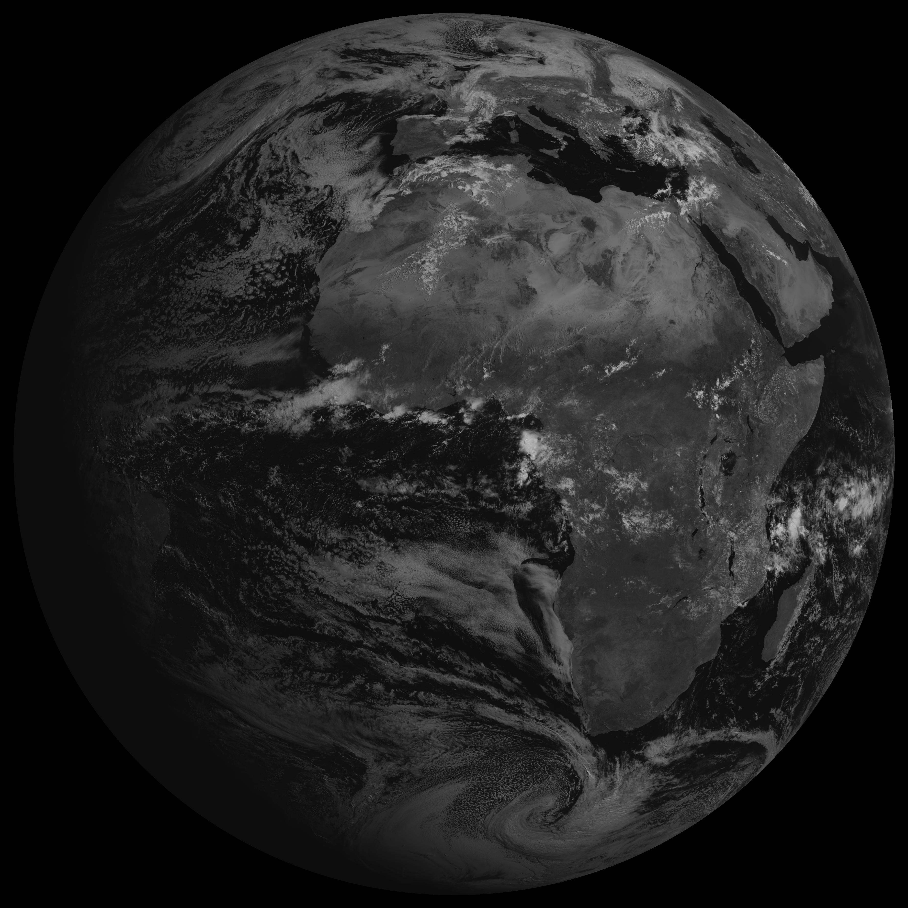
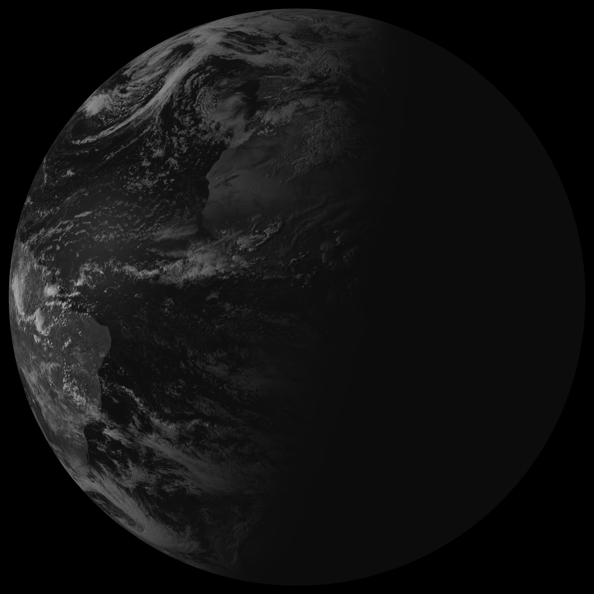
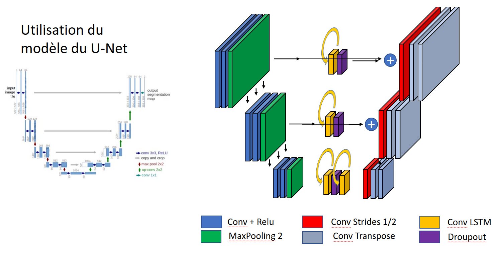

# Short Term Weather Forcasting
Short-term cloud density prediction using Satellite images and Computer Vision

## Dataset
You can find the dataset online, made by the EUMETSAT datacenter. I personnaly used images in visible wave length from the geostationary satellite MSG.

I took pictures from 9h27 to 17h27 to have a good view of the atlantic ocean, the area I chose to work on

## Development of the project
All the steps are presented in the PowerPoint (in french)

## Adopted solution

The best performing algorithms were the U-net and the U-net mixed with LSTM

